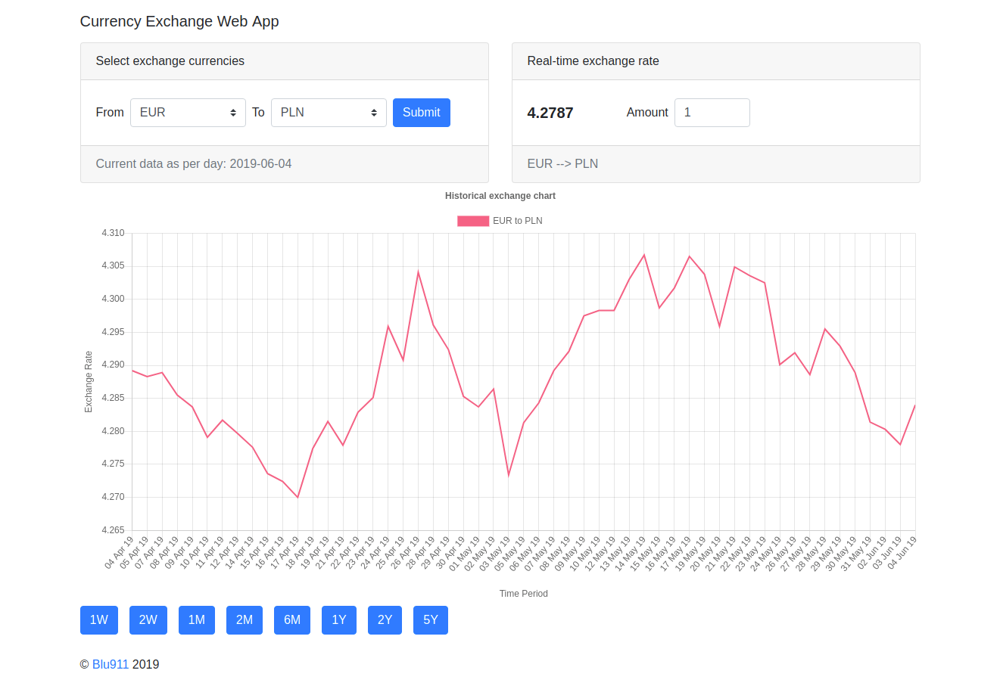

## INFO
Project in development.

## EN Currency Exchange Web application
The goal is to parse JSON files with currency exchange rates from the Alpha Vantage API and display them in web application.

### Run:
Online adress*: : *https://blu911-currency-exchange.herokuapp.com/*
*Please be patient, server usually sleeps, so sometimes is needed to wait a few seconds (max 60s) to load the page.

### Few sreenshots from the app

### Technologies:
* Spring Boot
* Spring MVC
* JUnit
* Thymeleaf
* JavaScript + JQuery
* Bootstrap
* jcabi-http
* Lombok
* SLF4J
